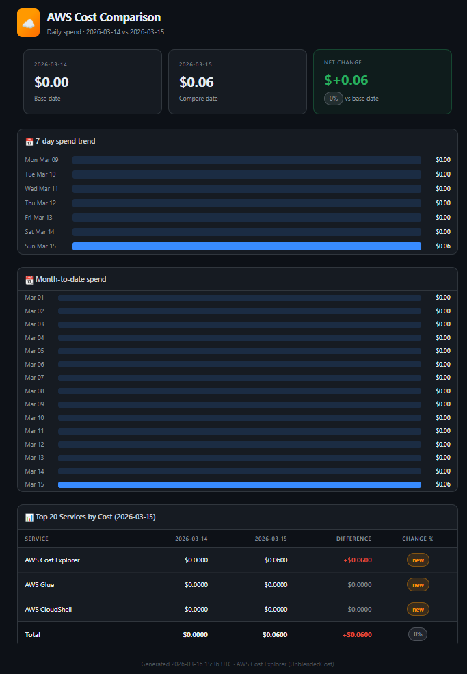

# AWS Cost Report

Automated daily AWS cost comparison report delivered by email.

## What it does
- Fetches yesterday vs the day before from AWS Cost Explorer
- Compares spend across all services
- Highlights cost spikes (20%+ increases)
- Shows 7-day and month-to-date spend trends
- Emails a formatted HTML report via AWS SES every morning

## Tech stack
- Python 3.12
- AWS Lambda (serverless, runs automatically)
- AWS Cost Explorer API
- AWS SES (email delivery)
- AWS EventBridge (daily schedule)

## Setup
1. Enable AWS Cost Explorer in the Billing console
2. Verify sender email in AWS SES
3. Deploy `cost_report.py` as a Lambda function
4. Attach IAM permissions for Cost Explorer + SES + CloudWatch Logs
5. Add an EventBridge trigger with cron `0 8 * * ? *`

## Configuration
At the top of `cost_report.py`:
```python
YOUR_EMAIL = "you@example.com"       # SES verified sender
RECIPIENTS = ["you@example.com"]     # List of recipients
SPIKE_THRESHOLD = 20                 # % increase to trigger spike alert
```

## Sample report

